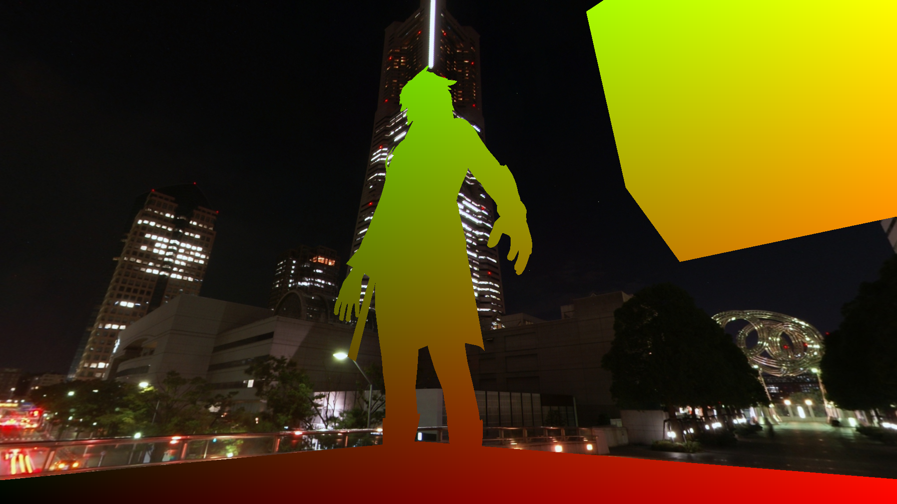
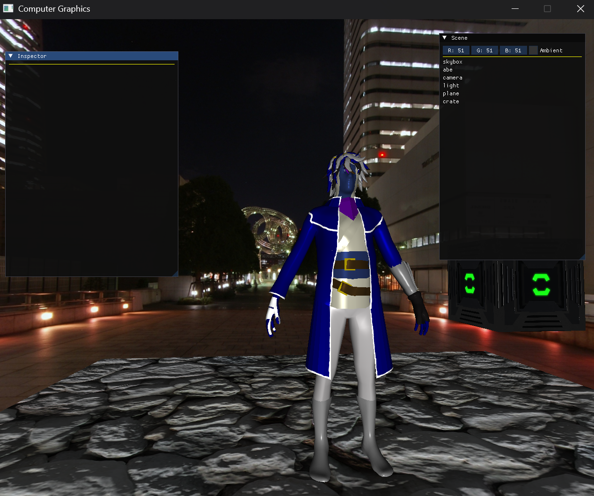
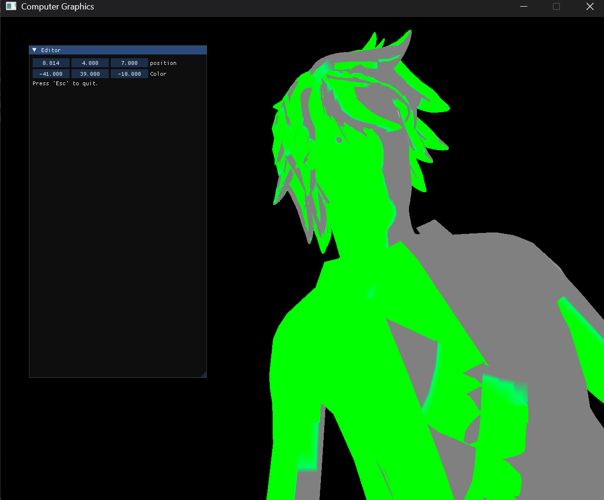
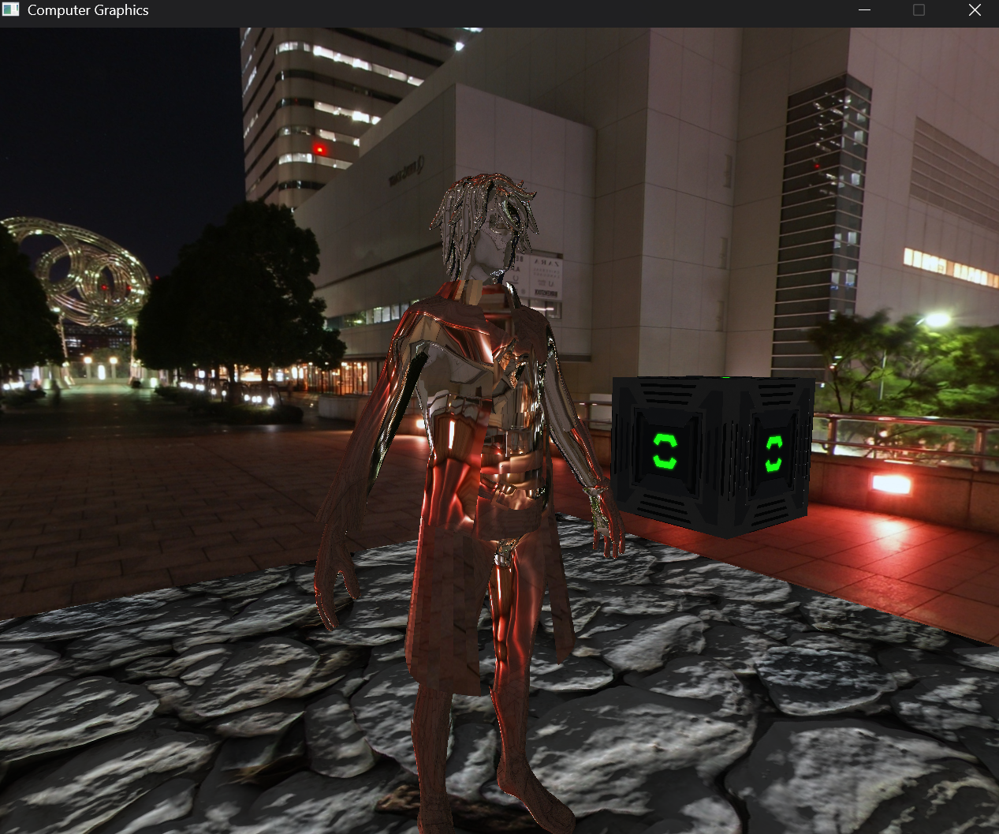

# Software Renderer (OpenGL)

Created for my GAT350 class. Uses OpenGL to render simple models, effects and shaders, while using ImGUI to control factors of the program in real-time.

## Key Features
* Utilizes ImGUI to allow runtime swapping of models, materials, and textures
* Also supports build-time setup via .JSON reading
* Multiple shaders using gorraud and Blinn-phong reflections
* Skybox
* Shadow mapping for objects

## Installation
1. Download [SDL3](https://github.com/libsdl-org/SDL/releases/tag/release-3.2.28), [the SDL3 image extention](https://github.com/libsdl-org/SDL_image), and [SDL-TTF](https://github.com/libsdl-org/SDL_ttf).
2. Also maybe get your hands on [OpenGL](https://www.opengl.org/) and [GLM](https://github.com/g-truc/glm)
3. Get [FMOD](https://www.fmod.com/download)
4. Get [assimp](https://github.com/assimp/assimp)
5. Finally, get [ImGUI](https://github.com/ocornut/imgui)
6. Put all of the .dll files (besides ImGUI) into the Build folder.

## Usage
* Start the project, or go through a scene.json folder to read in objects for the scene.
* You can use ImGUI to move, rotate and scale objects, change materials and textures, and more. Just play around with it.

## Technical Stuff
* We use a shadow map texture for shadows, which is a render target kind of camera rendering the scene on its own. You can also use it like a screen, if you wish.
* Phong and gorraud shading utilizes multiple shaders, all of which are under different programs in their materials.

## Attribution
Credit to all third-party libraries used above.
## Conclusion
Feel free to make a fork and mess around with it! One thing I really wanted to do was get multiple materials and textures for one model, but time was running short. Hope you enjoy!
